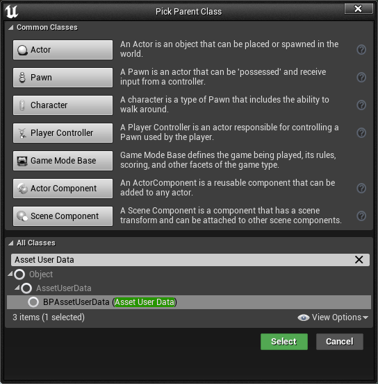
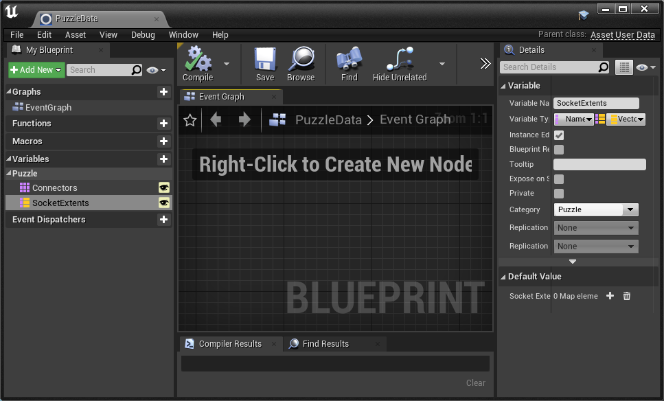
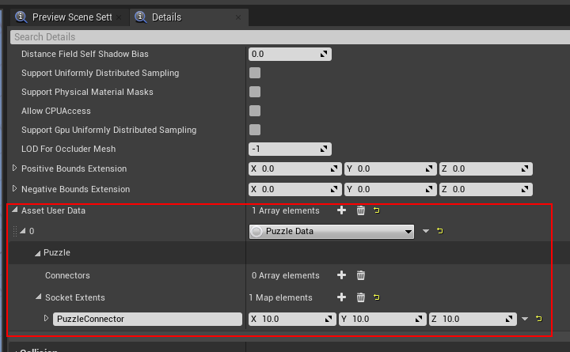
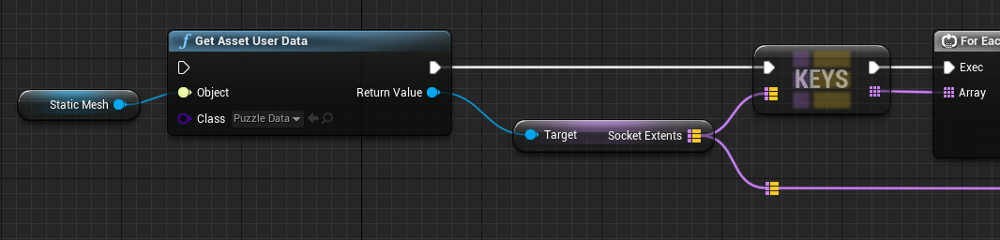
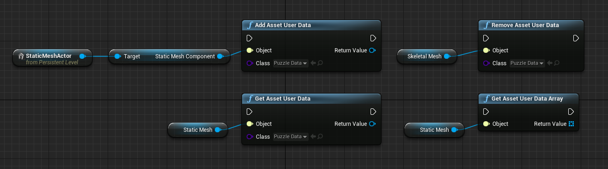

# Asset User Data for Blueprints

Don't know what Asset User Data is? It's effectively extra data you can add to (generally) any Asset or Component (or any object that implements `IInterface_AssetUserData`, and then can query upon at runtime. This is great for implementations where you only want to define the data once on the asset and not on a per actor basis (i.e. puzzle games).

The engine doesn't expose this to Blueprints, so this plugin does the work for you via the BPAssetUserData class and AssetUserDataFunctionLibrary.

## How do you use it?

1. Add this plugin to your project and compile it
2. If it isn't already, enable it and restart engine:\

3. Create a subclass of the BPAssetUserData class:\

4. Add some properties to your new blueprint:\

5. Add an instance of your Asset Data Blueprint to the Asset User Data array in an asset or component:\

6. Use the "Get Asset User Data" node to query asset data on reference to asset (or component):\

## Nodes
The add and remove nodes should mostly be used by editor utilities and assigned once. The add node will only add a single instance of the specified class. The getters are perfectly fine to use anywhere.\
